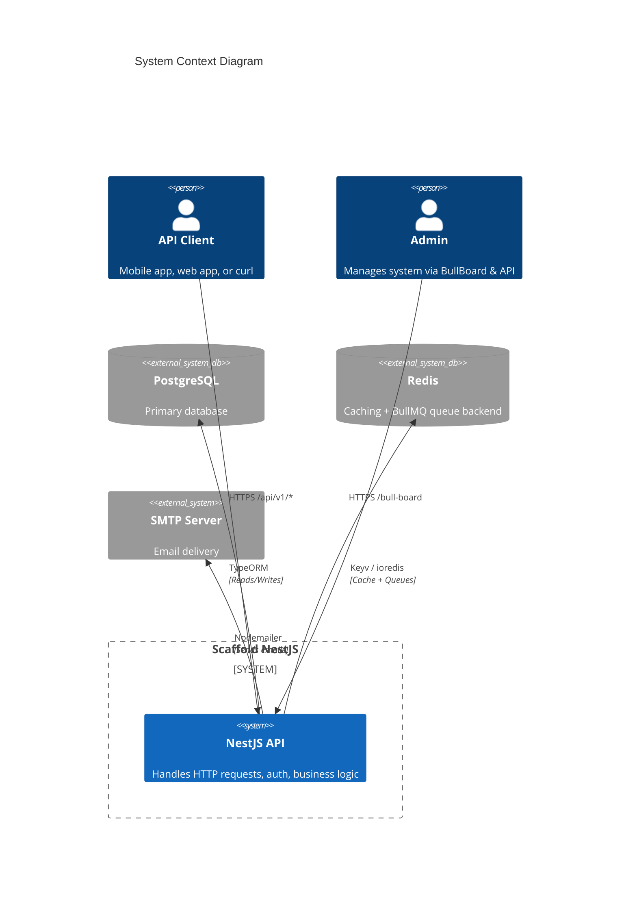
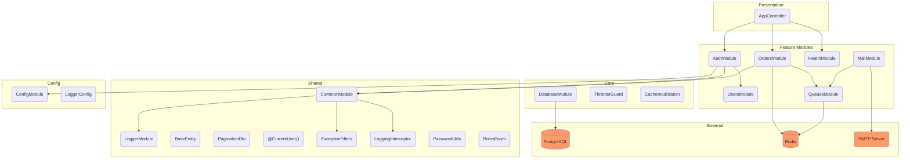
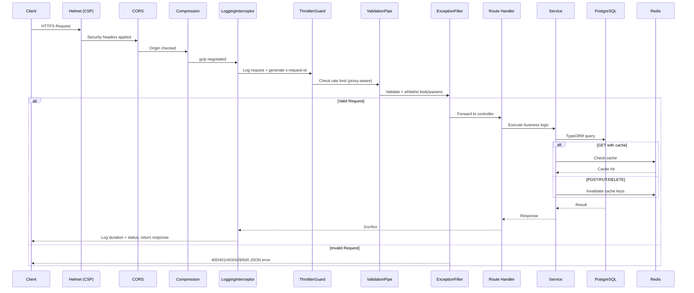
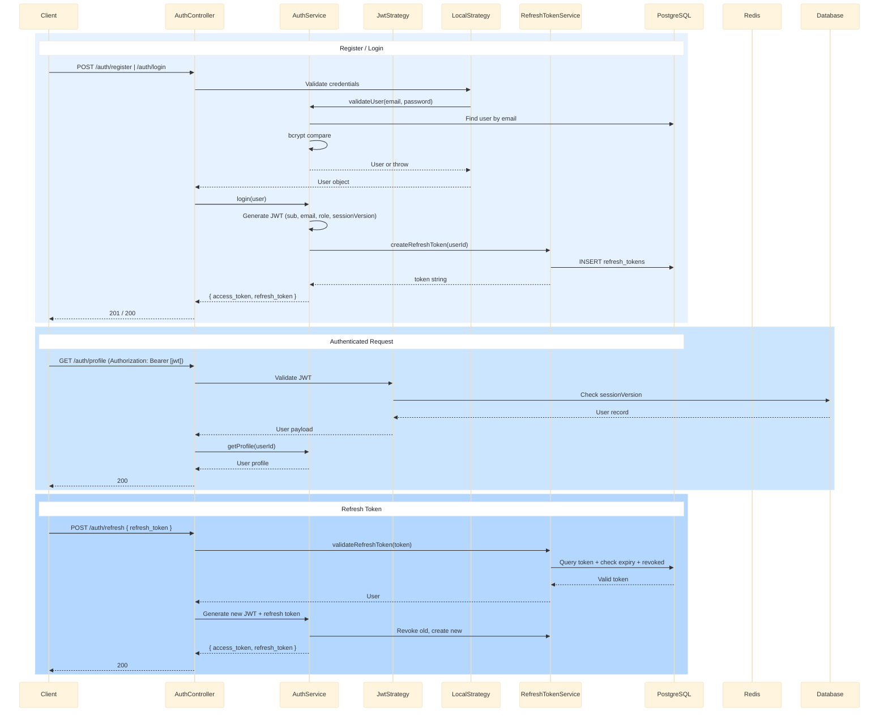
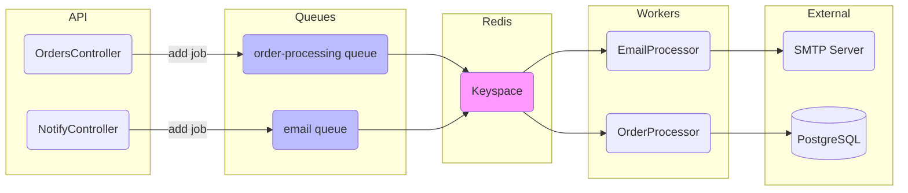
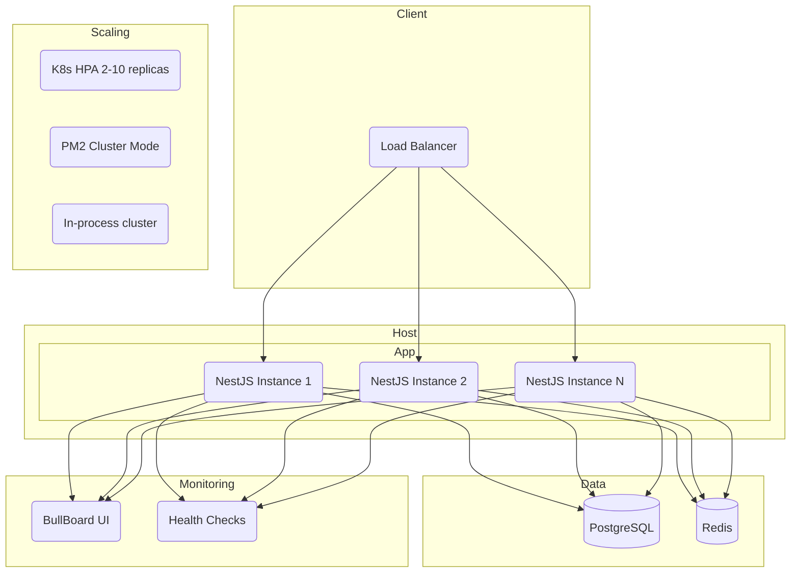
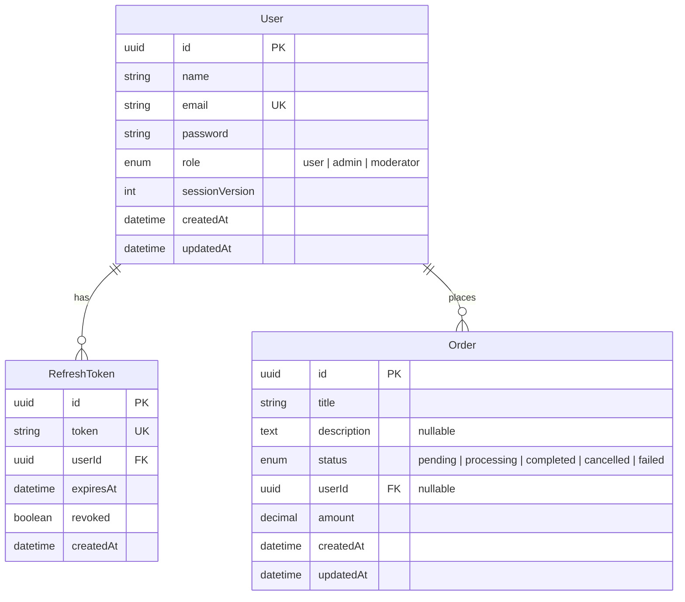

# Scaffold NestJS — High-Level Design

## 1. System Context



## 2. Application Module Architecture



## 3. Request Lifecycle



## 4. Authentication Flow



## 5. Async Job Processing (BullMQ)



## 6. Deployment Architecture



## 7. Data Model



## 8. Directory Map

```
src/
├── main.ts                         # Entry point + optional clustering
├── app.module.ts                   # Root module (wires everything)
├── app.controller.ts               # Root routes
│
├── config/                         # Env config + Joi validation + Winston
│
├── common/                         # Shared cross-cutting concerns
│   ├── logger.module.ts            #   Global Winston
│   ├── decorators/                 #   @CurrentUser()
│   ├── dto/                        #   PaginationDto
│   ├── entities/                   #   BaseEntity
│   ├── filters/                    #   4xx/5xx exception handlers
│   ├── interceptors/               #   Request logging
│   └── utils/                      #   bcrypt, roles enum
│
├── core/                           # Core infrastructure
│   ├── database/                   #   DataSource (postgres, unused sqlite)
│   ├── guards/                     #   Proxy-aware throttler
│   └── interceptors/               #   Cache invalidation
│
└── modules/                        # Feature modules
    ├── auth/                       #   AuthN/AuthZ + JWT strategies
    ├── users/                      #   User entity + CRUD
    ├── orders/                     #   Order CRUD + async processing
    ├── health/                     #   Health checks (Terminus)
    ├── mail/                       #   Async email via BullMQ
    └── queues/                     #   Queue definitions + BullBoard
```
